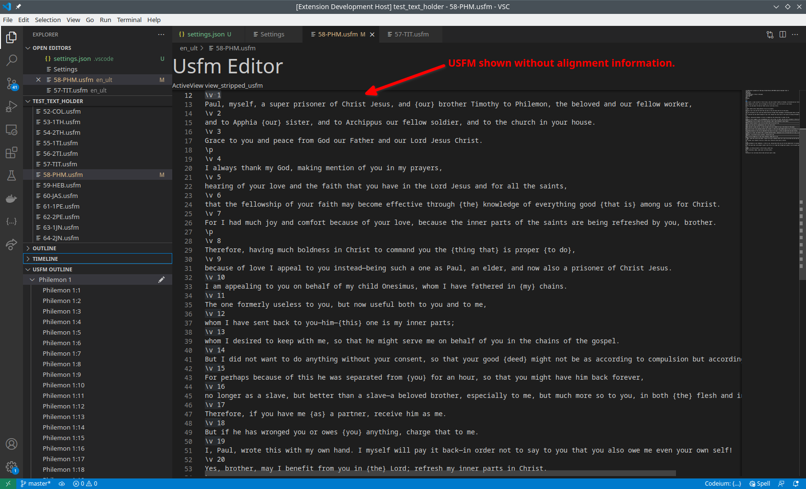
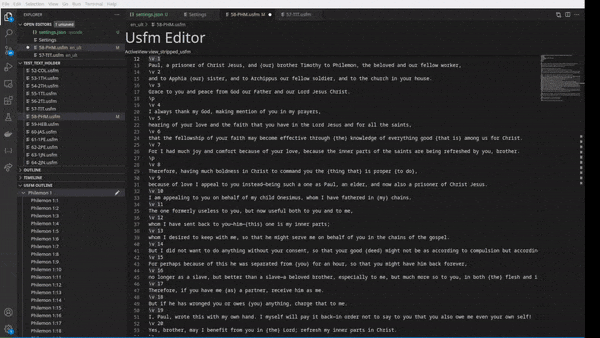
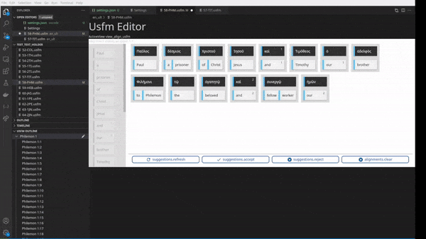
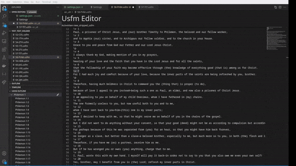

# usfmEditor - VSCode Plugin for Editing USFM Files

The `usfmeditor` plugin is designed to facilitate the editing of [USFM (Unified Standard Format Markup)](https://paratext.org/usfm/) files within Visual Studio Code.  USFM files are commonly used for storing Bible tranlsation, employing specific tags such as `\c` for chapter and `\v` for verse.  This plugin extends the functionality of VSCode to provide an editing experience for USFM files, particularly focusing on managing alignment information associated with translations.

## Features

### Stripped USFM View
The plugin offers a synthetic view of USFM files which transparently removes alignment information to enhance readability.  This view enables users to edit translations without the interference of intrusive alignment data.

### Alignment Editing Interface
Additionally, the plugin includes a user-friendly drag-and-drop interface dedicated to editing alignment information.  Users can easily associated target language words with their respective source language counterparts, verse by verse.

### Tree View for Navigation
Three tree view feature provides a structured representation of chapters and verses, facilitating seamless navigation within the stripped USFM view.  Users can quickly locate specific verses and activate the alignment editor as needed.

### Synced editing.
Information syncs dynamically between the stripped usfm view and the alignment dialog.  Alignment information for removed words is not lost until the document is saved or the alignment is modified.

## Extension Settings

The plugin offers a simple configuration option called `usfmEditor.sourceFolders`, allowing users to specify the directories where USFM files containing the source language (e.g., Greek or Hebrew) are located.  This configuration can be easily modified via VSCode's Workspace settings GUI.

## Usage

Once the plugin is enabled, opening a file which ends with .usfm should open in the Usfm Editor.  The content is added or removed using the stripped Usfm editor view which supports normal USFM syntax.

Once a verse is added, alinement can be added for that verse by clicking on the alignment action icon next to the verse in the USFM Outline panel.

Changes are using the vscode save action like any other document.  Undo and redo work.

## Installation

TODO

## Known Issues

* You can't actually add a new verse currently as the engine fails to merge with the existing alignment.  There is a fix already in the pipe for this, but hasn't yet landed.

## License

MIT License

## Disclaimer

This plugin is currently in a proof-of-concept stage and may require further refinement before being suitable for end-user deployment.  Most likely the code here will be combined together or split apart into other like proof-of-concept projects before being build into a end user product.